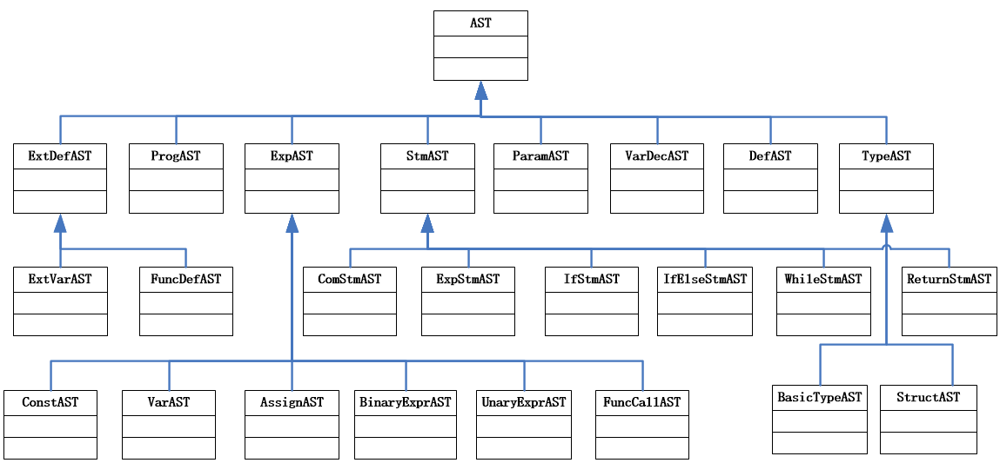

# tzlC

## How to Run?

Env Ubuntu 22.04, flex, bison, gcc, g++, spim
```bash
sudo apt-get install flex, bison, gcc, g++, spim
git clone git@github.com:HUSTZL/tzlC.git
cd tzlC
bash run.sh
./parser test1.c
spim
	load "ObjectFile.s"
	run
	exit
```

## 语法
```bison
program: ExtDefList		

ExtDefList:
          | ExtDef ExtDefList
          
ExtDef:     Specifier ExtDecList SEMI
          | Specifier ID LP ParamList RP CompSt
          | Specifier ID LP ParamList RP SEMI
          
Specifier:  TYPE

ExtDecList: VarDec
          | VarDec COMMA ExtDecList

VarDec:     ID   
          | VarDec LB INT RB

ParamVarDec:ID

ParamList:
          | ParamDec  
          | ParamList COMMA ParamDec
          
ParamDec:   Specifier ParamVarDec

CompSt:     LC DefList StmList RC

StmList:
          | Stmt StmList

DefList: 
          | Def DefList

Def:   		Specifier DecList SEMI 

DecList:    Dec
          | Dec COMMA DecList
          
Dec:  		VarDec
       	  | VarDec ASSIGN Exp

Case:   	CASE Exp COLON StmList  

CaseList:	Case               
       	  | Case CaseList

Stmt:       Exp SEMI    		
      	  | CompSt      		
      	  | RETURN Exp SEMI   	
      	  | RETURN SEMI   	    
      	  | IF LP Exp RP Stmt %prec LOWER_THEN_ELSE 
      	  | IF LP Exp RP Stmt ELSE Stmt   		  
      	  | WHILE LP Exp RP Stmt 	
      	  | FOR LP Exp SEMI Exp SEMI Exp RP Stmt 
      	  | SWITCH LP Exp RP LC CaseList RC   
      	  | SWITCH LP Exp RP LC CaseList DEFAULT COLON StmList RC
      	  | BREAK SEMI        
      	  | CONTINUE SEMI       
      	  | error SEMI 

Exp:    	Exp ASSIGN Exp
      	  | Exp PLUS Exp 
       	  | Exp MINUS Exp
       	  | Exp STAR Exp
       	  | Exp DIV Exp 
		  | Exp MOD Exp 
       	  | LP Exp RP
       	  | MINUS Exp %prec UMINUS  
       	  | PLUS Exp %prec UPLUS

       	  | Exp AND Exp   
       	  | Exp OR Exp    
       	  | NOT Exp

       	  | Exp GT Exp	
       	  | Exp GE Exp 	
       	  | Exp LT Exp 	
       	  | Exp LE Exp 	
       	  | Exp NE Exp 
       	  | Exp EQ Exp

       	  | DPLUS Exp
		  | DMINUS Exp
		  | PLUSD Exp
		  | MINUSD Exp

       	  | ID LP Args RP
       	  | ID
		  | ID SubList            	
       	  | INT           	
       	  | FLOAT       
       	  
Args:  
       	  |  Exp 
       	  |	 Args COMMA  Exp

Sub:         LB Exp RB

SubList: 	 Sub                
    	  |  SubList Sub         {$$=$1; $$.push_back($2);}

```


## 绑定关系
```
ProgAST*                 program;
vector <ExtDefAST*> 	 ExtDefList;  	    //外部定义（外部变量、函数）列表
ExtDefAST* 				 ExtDef;
vector <VarDecAST*>  	 ExtDecList;        //外部变量列表（目前后续只考虑是标识符，可扩展为数组）
TypeAST*				 Specifier;
VarDecAST* 				 VarDec;
CompStmAST*				 CompSt;
vector <ParamAST*>  	 ParamList;         //形参列表
ParamAST* 				 ParamDec;
vector <StmAST*>   		 StmList;
StmAST* 				 Stmt;
vector <DefAST*>   		 DefList;
DefAST* 				 Def;
vector <VarDecAST*> 	 DecList;
VarDecAST* 				 Dec;
ExpAST* 				 Exp;
vector <ExpAST*>    	 Args;       		//实参列表
```

## Class of AST




```
class AST ProgAST ExtDefAST TypeAST VarDecAST CompStmAST ParamAST StmAST DefAST VarDecAST ExpAST
```

## Class of Symbol

```
class Symbol VarSymbol FuncSymbol SymbolsInAScope SymbolStackDef
```

## Class of IRCode

```
class Opn//变量或函数表示
class IRCode//四元式结构
```

## Class of Error Management

```
extern map <int,string> SymbolMap;
extern map <int,int>    TypeWidth;
```


```
typedef struct { int Line,Column;  string ErrMsg; }Error;
class Errors //用来记录语法、语义错误
```

## 静态分析中的错误处理

```
（1）使用未定义的变量； √
（2）调用未定义或未声明的函数； √
（3）在同一作用域，名称的重复定义（变量名、函数名）。为更清楚说明语义错误，这里也可以拆分成几种类型的错误，如变量重复定义、函数重复定义、形参名重复定义 √
（4）对非函数名采用函数调用形式；  √
（5）对函数名采用非函数调用形式访问； √
（6）函数调用时参数个数不匹配，如实参表达式个数太多、或实参表达式个数太少； √
（7）函数调用时实参和形参类型不匹配； √
（8）对非数组变量采用下标变量的形式访问； √
（9）数组变量的下标不是整型表达式； √ 
（10）赋值号左边不是左值表达式；  √
（11）对非左值表达式进行自增、自减运算；  √ 
（12）类型不匹配。需要指出类型不匹配错误；有些需要根据定义的语言的语义自行进行界定，比如：32+'A'，10*12.3，如果使用强类型规则，则需要报错，如果按C语言的弱类型规则，则是允许这类运算的，但需要在后续阶段需要进行类型转换，类型统一后再进行对应运算； √
（13）函数返回值类型与函数定义的返回值类型不匹配； √
（14）函数没有返回语句（当函数返回值类型不是void时）； √
（15）break语句不在循环语句或switch语句中；√
（16）continue语句不在循环语句中；√
（17）switch 语句的key值不是常数 √
（18）switch 语句的key值相等 √
（19）调用的函数已经声明但未定义 √
（20）函数声明和定义的返回类型不同，或参数数目不同，或声明和定义的形参类型不一致 √
```

## workflow

***2023.1.11*** Read Code.

***2023.1.13*** 加入如下内容

```
行注释与块注释 √
自增自减 √
for循环 √
补全根据值确定转移方向 √
break √
continue语句 √
静态分析中的错误处理  9/16
```

***2023.1.14*** 重写了语法，并加入如下内容

```
静态分析中的错误处理  18/20
function declaration √
	Solution:
	处理声明时，登记到符号表中，这时包含函数名和参数等信息，只是标记清楚这时一个函数声明，不是完整定义。在处理后面的定义时，首先会在符号表中查找到这个函数的声明，分析参数类型是否一致，一致就继续分析函数的定义，函数定义正确后，将符号表中的函数标记修改成函数定义就行
	定义一个数据结构，记录只有函数声明和调用的信息.有定义后就删除这项，有调用就记录一下，最后这个数据结构中如果包含有被调用的函数声明就报错，如果没有被调用，这个函数声明可以不理会，不算错.
```


***2023.1.15*** 修改了语法，修复了一个关于函数声明的重大Bug，实现了数组，并加入如下内容

```
数组 √
	多维数组在定义时，在符号表中登记内情向量，记录在活动记录中的偏移地址，各维大小，元素类型等。
	在数组元素的中间代码生成时，分读和写两个运算，包含数组偏移地址，元素在数组区域的偏移地址
	目标代码生成时，根据这两个偏移地址累积，再加上$sp就得到数组元素的地址，完成读或写的操作
	仍然留下了很多问题，例如：数组函数参数，数组整体赋值.但咨询祝建华老师，此处不考虑，故重新调整了语法，限制了数组作为函数参数，数组的整体赋值
静态分析中的错误处理 √
function declaration Bug Fix √
	但是在这里出现了一个巨大的问题，就是符号表的问题。符号表内含次序存放不同level的SymbolsInAScope，SymbolsInAScope内存放参数，如果我们这样处理函数声明的话，函数声明的局部参数表就会保留在参数表内。而不是像只有函数定义的时候一样，处理完了这个复合语句后就被弹出了。导致符号表出了问题，后续出现了很多问题。

	Fix：修改为树形的符号表
		OR 再遇到函数定义时，参数再入符号表，结束函数定义时退出符号表。 简单 如此处理
		OR 处理定义时，将前面参数复制过来，接着做函数定义的处理，结束后退栈也是一样 
```

***2023.1.16*** tzlC结项，使用全局变量能够完成快速排序，指定需求全部完成并多余实现了Switch语句 + 函数声明 + 外部变量

```
外部变量的问题，如何在静态区中分配存储单元 √
	Solution:这个就是对函数之外的变量，偏移量相对于gp,在静态区分配存储单元，对符号表中的变量访问是，如果层号为0，那就是是由gp和偏移量获取变量地址，不是$sp和偏移量获取变量地址 
目标：快速排序 √
```
----------------------------------


by ***HUSTZL***, School of Software Engineering, Huazhong University of Technology and Science, Wuhan, China.

Team Leader: Haofei Hou.

Team member: Mingchen Liu, Fengxuan Gan.

Contact: yuechuhaoxi020609@outlook.com

2023.1.13